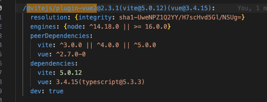
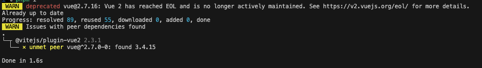
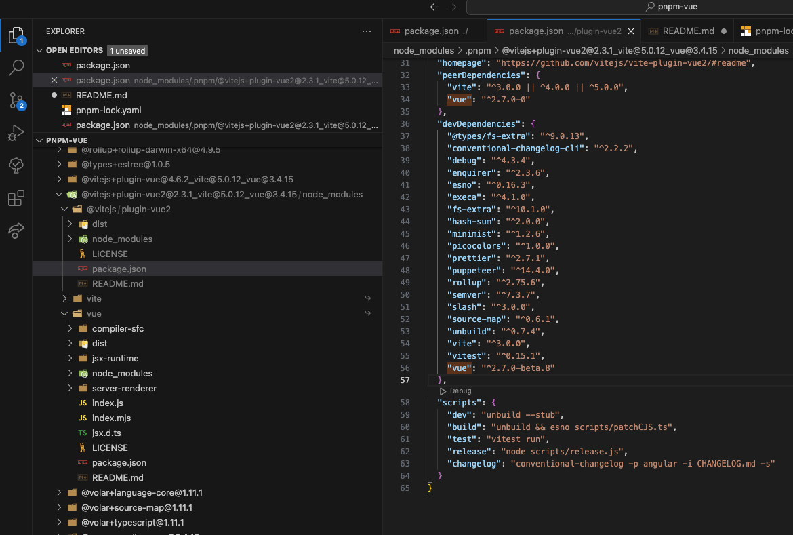

# the issue

This repo shows the package `@vitejs/plugin-vue2` having `vue@3` resolved as its dependency, despite it requiring `vue@2` in its `package.json`.

I'm trying to figure out the problem here. I need `@vitejs/plugin-vue2` to use `vue@2`. It works fine when the only `vue` in the project is `vue@2` but breaks when using the `pnpm` alias to install both v2 and v3 of vue. 

As you can see in the lockfile, here

vue 3.4.15 is the resolved dependency of @vitejs/plugin-vue2 and its peer dependency is the correct semver range, ^2.7.0-0

and it shows a warning of a missing peer on `pnpm i`

I'm trying to figure out why vue@3.4.15 is listed as a dependency here.

If you look at @vitejs/plugin-vue2 code, 

you can see that vue@3 is installed by `pnpm` despite vue@3 not being mentioned anywhere in `@vitejs/plugin-vue2`'s package.json.

I have tried using the `.pnpmfile.cjs` `readPackage` hook to forcefully make vue@2 a dependency of @vitejs/plugin-vue2, but that doesnt seem to work either.

I understand that "vue" in my package.json is not vue@2, since I made the alias, vue2. However, I would expect a dependency's dependency to use the version defined in it's package.json, regardless of what its parent (this project) has in its package.json.

If that's not something I should be expecting, then, how do I make it work?

I was thinking maybe that pnpm was following @vitejs/plugin-vue2's `import/require` for vue, and since this project has `vue@3`, it was resolving to that. So my solution was to use `pnpm patch @vitejs/plugin-vue2@2.3.1` to to change the imports for `vue` to my alias, `vue2`. This unfortunately did not work either.

